# Gesture-Controlled Surveillance Robot (D.I.G.I.T. / Wall-INI) — Kushl Lab Notebook

**Author:** Kushl Saboo  
**Course:** ECE 445 Senior Design  
**Project:** D.I.G.I.T. / WALL·E-inspired gesture-controlled surveillance robot (Wall-INI)

---

## January 15th, 2026

**Objective:** Brainstorm initial ECE 445 project ideas and identify concepts that could have a strong sensing, control, and demo component.

**Record of Work Done:**  
Roshni, Suvid, and I discussed several possible project directions. These included a wearable motion-to-sound device, a tactile music visualizer for deaf/hard-of-hearing users, a smart refrigerator/food spoilage shelf, and robotics-related ideas. I was especially interested in concepts that involved intuitive human interaction, gesture control, and robotics because they would let us combine sensors, embedded systems, and a physical demo.

At this stage, the strongest direction seemed to be a project where human motion could control an external system. This helped lead us toward later ideas involving a glove interface and robotic control. I also felt that projects with clear user interaction would likely be easier to demonstrate and verify than a purely sensing-only device.

---

## January 22nd, 2026

**Objective:** Submit an early web-board project idea and frame the problem statement around robotics.

**Record of Work Done:**  
Suvid, Roshni, and I drafted an initial WALL·E-inspired autonomous waste-collecting robot idea. The concept was a compact robot that could move around, detect objects, and potentially collect small pieces of waste. The main design goal was to create a low-cost robotics platform with sensing, movement, and some autonomy.

Although this was not the final direction, it helped us establish the WALL·E-inspired theme and the idea of a small mobile robot as the physical platform. We also started thinking about what would make the robot useful rather than only aesthetic.

---

## January 26th, 2026

**Objective:** Reevaluate the project concept and compare autonomous waste collection with a gesture-controlled robot.

**Record of Work Done:**  
We discussed the idea of building a gesture-controlled surveillance robot. Suvid brought up the gesture-control direction, and I was interested in making the robot more interactive by using a glove as the control interface. Roshni helped us think through the scope and whether features like obstacle avoidance, camera feedback, and more advanced vision would be realistic for the semester.

At this point, we also considered a two-glove system where one glove would control the robot base and the second glove would control a robotic arm. After talking it through, we realized this would likely be too ambitious. This discussion was still useful because it helped us decide that the glove should be the main control interface and that the robot should focus on movement, sensing, and surveillance.

---

## February 1st, 2026

**Objective:** Compare mind-control, camera-based gesture recognition, and glove-based gesture control.

**Record of Work Done:**  
Roshni, Suvid, and I briefly considered a “mind-controlled” robot, but after looking into EEG-style sensors, we realized that the hardware would be expensive and the control quality would likely not be reliable enough for our project. We also discussed camera-based gesture recognition, but this would require more computer vision processing and could make the system less reliable.

The glove-based approach became the most realistic option. It would allow us to directly measure hand motion and finger bending with sensors instead of relying on external image processing. This also made the project more hardware-focused and better aligned with ECE 445 expectations.

---

## February 2nd, 2026

**Objective:** Finalize the project idea with TA feedback and reduce project scope to something achievable.

**Record of Work Done:**  
Roshni, Suvid, and I met with our TA to discuss whether the gesture-controlled robot idea was strong enough for ECE 445. The TA indicated that having the custom PCB focused on the glove would be acceptable because the glove is the main interface and the center of the project.

We decided to use one glove instead of two. The one-glove system would control the robot’s movement through hand gestures. We removed the second-glove robotic arm idea because the arm would introduce additional mechanical design and kinematics work that could take away time from the main embedded control system.

The main technical risk identified was wireless communication, so we planned to start verifying Bluetooth/BLE functionality early.

---

## February 10th, 2026

**Objective:** Clarify project requirements, component choices, and division of early technical work.

**Record of Work Done:**  
After talking with the TA, Roshni, Suvid, and I noted several important design constraints. The glove PCB needed to include a soldered chip/module and should not rely on a full Raspberry Pi-style single-board computer. Suvid and I discussed BLE-capable microcontrollers such as ESP32 and nRF-based boards, while Roshni helped us keep the overall subsystem requirements organized. We also noted that our block diagram needed to clearly show power lines and communication paths.

We created an early plan to test BLE first, then motor control, then sensors. This order made sense because wireless command transmission was the biggest integration risk. We also began thinking about proof-of-concept tests for the breadboard demo.

---

## February 13th, 2026

**Objective:** Finalize the proposal direction and problem statement.

**Record of Work Done:**  
Roshni, Suvid, and I finalized the project framing around the problem that many robot control interfaces are not intuitive, especially in situations where a joystick or traditional controller is inconvenient. Our proposed solution was a wearable glove that maps hand gestures to robot movement commands.

The robot was framed as a small surveillance platform. The planned safety and awareness features included a camera for viewing the robot’s surroundings and ToF sensors for detecting obstacles. This gave the project a clearer purpose beyond simply being a gesture-controlled toy.

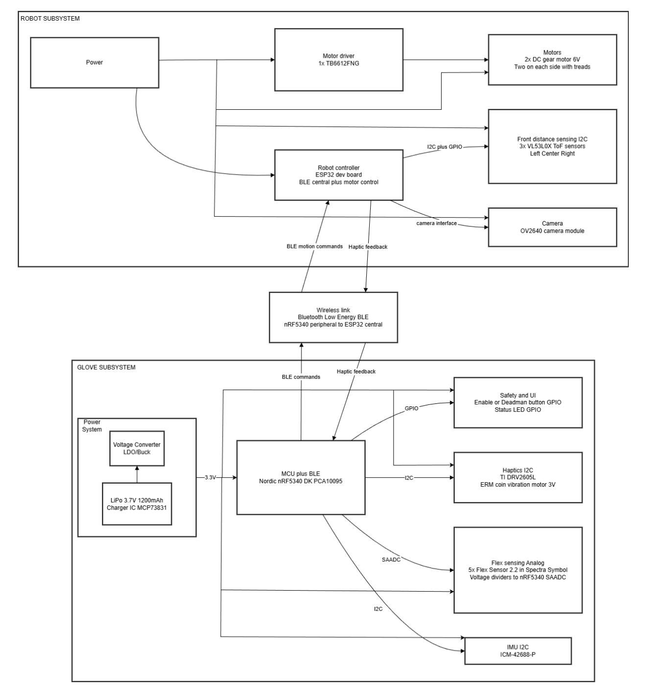

---

## February 16th, 2026

**Objective:** Investigate mechanical fabrication options through the machine shop.

**Record of Work Done:**  
Roshni and Suvid looked into whether the machine shop could help fabricate the robot body. The main takeaway was that the machine shop would not be ideal for making the robot look like WALL·E or for producing more aesthetic parts. We also learned that a tracked/treaded system would likely be difficult and expensive to size correctly.

This influenced our later decision to use a simpler wheeled robot design and eventually 3D print the body ourselves. Keeping the chassis simple reduced mechanical risk and allowed us to focus more on controls, sensing, and integration.

---

## February 24th, 2026

**Objective:** Research motor and MCU options for the robot and glove subsystems.

**Record of Work Done:**  
Suvid, Roshni, and I compared different small DC gear motors, including 6 V N20-style motors and Pololu-style micro metal gearmotors. We considered speed, torque, wheel size, and how much current the motors might require. We also discussed several MCU options, including ESP32-S3, STM32, ATmega, and nRF-based devices.

The design goal was to choose parts that were small enough for the robot body but still capable of producing enough torque for the final weight. We also wanted an MCU with enough pins for motors, ToF sensors, camera, and wireless communication.

---

## February 27th, 2026

**Objective:** Prepare the design review and define base goals versus stretch goals.

**Record of Work Done:**  
Roshni, Suvid, and I worked on the design review materials and organized the project into required and stretch functionality. The base goals were that the glove should classify five commands: stop, forward, backward, left, and right; the glove should transmit the command to the robot; and the robot should execute the command.

Stretch goals included obstacle-based stopping, camera livestreaming, and haptic feedback from the robot back to the glove. I helped think through how the robot behavior should map to the user experience, especially for intuitive motion and WALL·E-inspired interaction. Suvid focused heavily on the PCB and component direction, while Roshni helped organize the design review content and glove/system layout.

---

## March 10th, 2026

**Objective:** Prepare for the breadboard demo by proving basic Bluetooth/BLE communication.

**Record of Work Done:**  
Roshni and Suvid worked on a basic Bluetooth proof of concept using available parts because some ordered components had not arrived yet. The system used an nRF-based Bluefruit Feather BLE module and an ESP32-C6. We verified that data could be sent back and forth and also tested basic interaction with an old ToF sensor.

This was not the final hardware setup, but it showed that wireless communication between embedded devices was feasible and gave us a starting point for the robot-glove communication pipeline.

---

## March 11th, 2026

**Objective:** Demonstrate early proof-of-concept functionality and identify the next integration steps.

**Record of Work Done:**  
We confirmed that the LiDAR/ToF sensor could work and that Bluetooth functionality was present. The main next step was to connect these pieces so that sensing and communication could eventually work together. Roshni, Suvid, and I also planned to keep building toward the robot subsystem once the remaining parts arrived.

---

## March 23rd, 2026

**Objective:** Begin robot subsystem bring-up using the ESP32-S3, motor driver, ToF sensor, and camera.

**Record of Work Done:**  
We received the main robot components: ESP32-S3, TB6612FNG motor driver, VL53L0X ToF sensors, OV3660 camera, and 6 V micro DC motors. The first goal was to get the robot moving under ESP32 control.

Roshni spent a lot of time getting the ESP32-S3 to control the motors through the motor driver. Motor debugging took longer than expected. The PWM output was difficult to verify without an oscilloscope, so we used a simple lightbulb test as a rough way to check whether output was changing. We also realized the motor torque was lower than expected, likely because the selected motor/current capability was not ideal for the final robot weight.

On the sensing side, we tested the ToF sensor code and brought up the camera livestream. The camera required resolving Wi-Fi-related setup issues. The robot code was then combined so that keyboard inputs could command forward, backward, left, right, and stop. The ToF sensor was used to stop the robot when an obstacle was detected, while the camera streamed continuously.

<video controls width="720" src="./media/robot-parts-demo.MOV">
  Your browser does not support embedded video.
</video>
---

## March 25th, 2026

**Objective:** Decide final mechanical fabrication approach.

**Record of Work Done:**  
Suvid, Roshni, and I decided not to rely on the machine shop for the robot body. Instead, we planned to 3D print the robot chassis and related parts. This gave us more control over the WALL·E-inspired shape, sensor placement, and component mounting.

This decision also meant that I needed to spend more time on CAD and mechanical iteration. The design needed to hold the breadboard/electronics, motors, battery, camera, and ToF sensors while still being small enough to move reliably.

---

## March 27th, 2026

**Objective:** Start planning CAD tasks for the robot chassis and mechanical parts.

**Record of Work Done:**  
I planned the main CAD tasks for the robot platform. These included the robot body, wheel design, camera holder, motor placement, battery placement, and internal supports for electronics. Suvid and I also talked through practical layout constraints, such as leaving enough space for the breadboard, motor driver, ESP32, battery, ToF sensors, and camera while still keeping access for wiring and USB/programming.

---

## March 31st, 2026

**Objective:** Create the first CAD version of the robot body and choose sensor/camera placement.

**Record of Work Done:**  
We moved forward with a 3D-printed robot body. The first CAD version used a pentagonal-style shape because the angled front could allow ToF sensors to detect obstacles while turning. I helped with the mechanical planning for how the robot body should hold the components and how the sensors should be positioned.

Roshni, Suvid, and I also decided to move the camera from the top of the robot to the front because the camera ribbon cable was too short to mount it high enough above the body. This design decision affected the surveillance behavior: instead of rotating the camera separately, the whole robot could rotate in place to scan the environment.

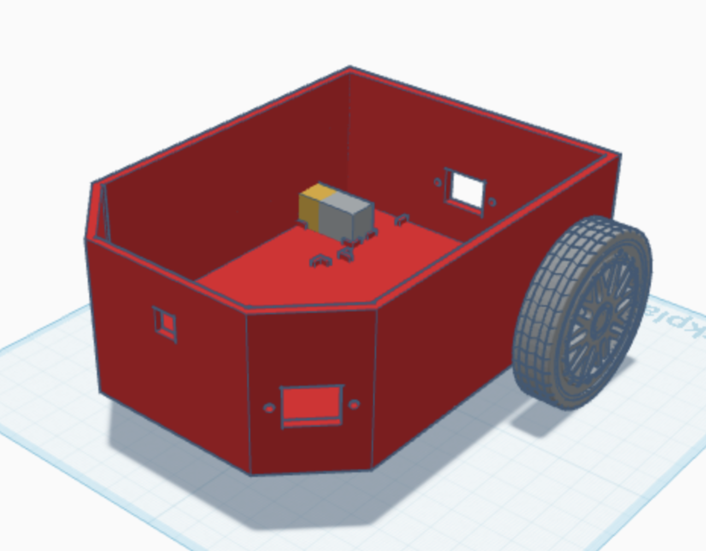

---

## April 4th, 2026

**Objective:** Print and evaluate the first robot body prototype.

**Record of Work Done:**  
Roshni, Suvid, and I printed the first body prototype and evaluated fit and sensor placement. The print showed several issues. The pentagonal shape was not as useful as expected because it limited direct forward ToF sensing. The snap-fit areas for the motors and breadboard were also too tight, with tolerances off by about 1–2 mm.

The result showed that the robot body needed to be simplified and that 3D printing tolerances had to be considered. This led us to redesign the body with a more rectangular layout and more practical mounting features.

---

## April 5th, 2026

**Objective:** Test robot communication using LightBlue and plan multiple ToF sensor integration.

**Record of Work Done:**  
I tested the robot BLE connection using the LightBlue mobile app. The process was to search for the ESP32 robot, connect, switch the write format from hex to string, and send command values. This helped verify that the robot could receive commands over BLE before the glove was fully integrated.

I also started looking into how to wire additional ToF sensors. Because multiple VL53L0X sensors share the same default I2C address, Suvid and I discussed using XSHUT pins to enable sensors one at a time and assign addresses. This became important for adding left, right, and front/back obstacle awareness.

---

## April 7th, 2026

**Objective:** Assemble robot body V2, test printed wheels, and add Bluetooth command control.

**Record of Work Done:**  
Roshni, Suvid, and I printed a second robot body version with a simpler rectangular layout. We also printed wheels, but the wheel fit required several iterations because the motor shaft fit was either too tight or too loose. Once the robot was assembled, we tested sending movement commands over Bluetooth from a phone.

The main mechanical issue was traction. The 3D-printed wheels slipped on the floor, so we planned to improve the wheel surface and eventually add tape or another material for friction. The robot also needed more internal space for the battery.

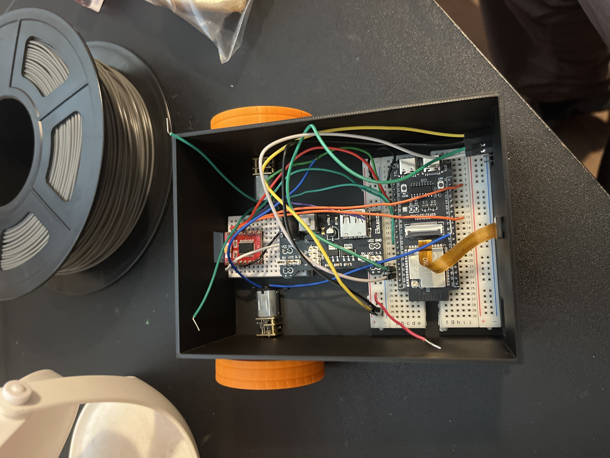

---

## April 15th–16th, 2026

**Objective:** Continue ToF sensor work and prepare for more complete obstacle detection.

**Record of Work Done:**  
I planned to continue working on the ToF sensors and their wiring. The goal was to have multiple sensors active so the robot could detect obstacles in more than one direction. This was important for both safety stopping and directional haptic feedback. Suvid and I also discussed how the extra sensors would connect electrically without conflicting with the rest of the ESP32 pins.

---

## April 18th, 2026

**Objective:** Support glove PCB mechanical integration with a 3D-printed holder.

**Record of Work Done:**  
Once Suvid finished the glove PCB, Roshni and I measured it and began designing/printing a holder for it. The purpose was to mount the PCB cleanly on the glove so that the wiring to the flex sensors, IMU, and haptic motors would be manageable.

This first holder concept worked mechanically for the PCB, but it did not fully solve the flex sensor comfort and routing problem. The design still needed iteration so the glove could be worn and used reliably.

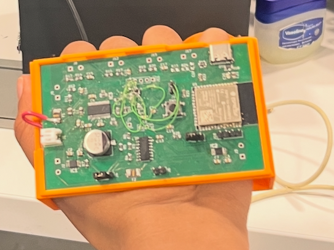

---

## April 19th, 2026

**Objective:** Add multiple ToF sensors and test communication/control between the glove PCB and robot.

**Record of Work Done:**  
I worked on adding additional ToF sensors to the robot. The planned wiring used a secondary I2C bus with SDA/SCL on GPIO 41/42 and XSHUT control pins on GPIO 34 and GPIO 40 for additional ToF sensors. After wiring and testing, all ToF sensors were able to work.

During this integration, the robot did not always appear in LightBlue, likely because the system was now directly communicating with the other ESP32 rather than acting as the same phone-visible BLE device. I tested movement commands from the PCB side and was able to get the robot to move, though initial movement was not strong enough. The next step was to make movement consistent enough to test obstacle stop behavior and direction-based ToF states.

By the end of the session, Suvid and I had the robot-glove communication path working more reliably.

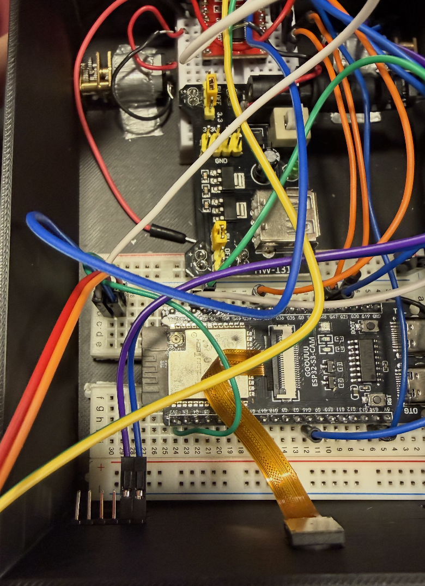
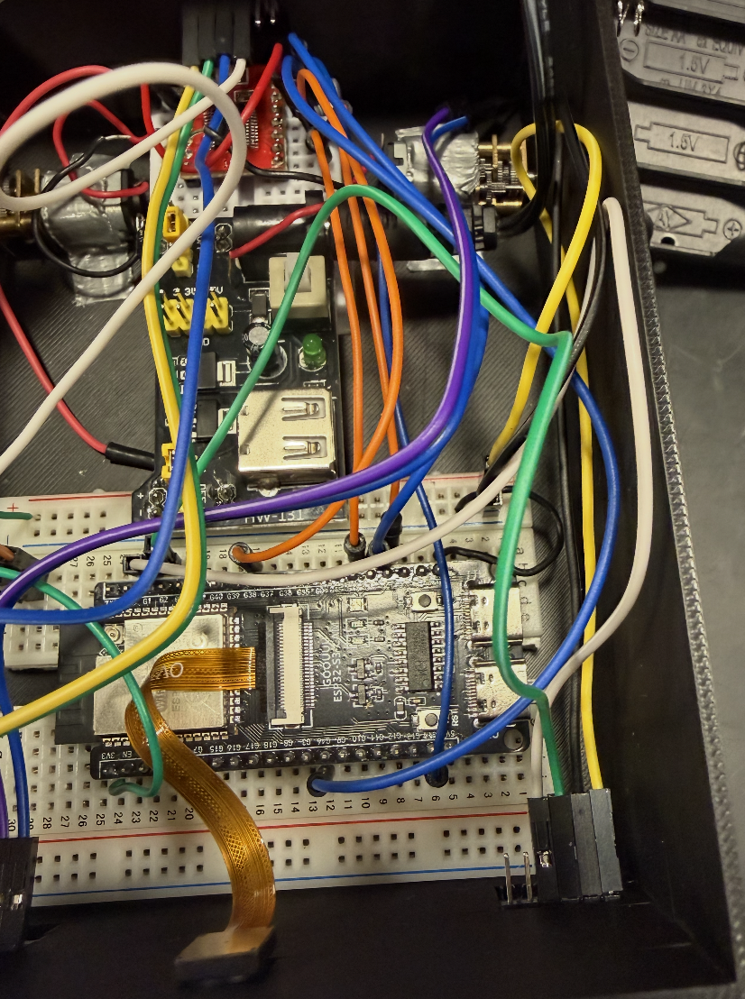
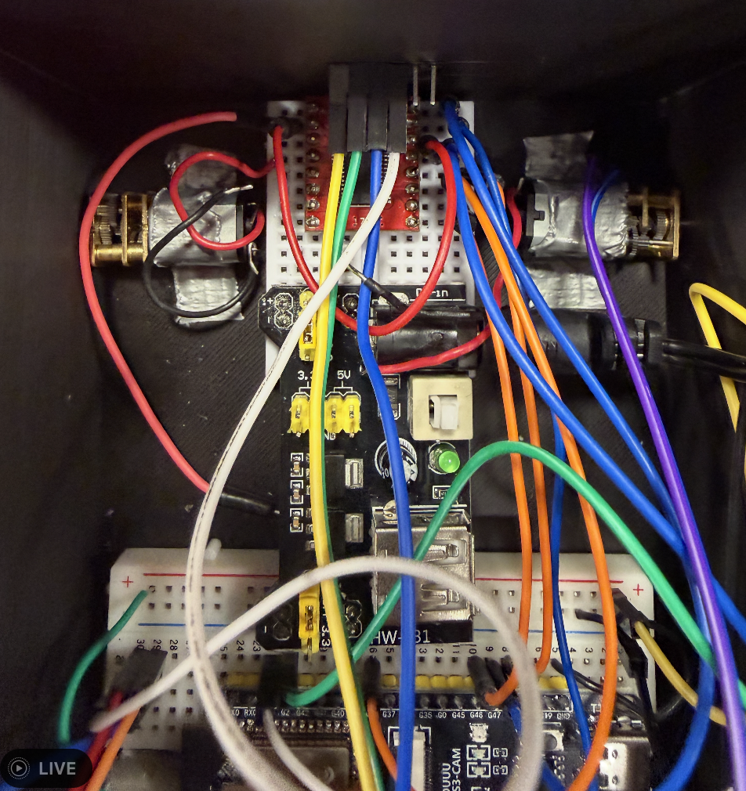

---

## April 20th, 2026

**Objective:** Assign final tasks, update robot body design requirements, and transition from phone control to glove control.

**Record of Work Done:**  
Roshni, Suvid, and I made a task list for the final implementation push. My tasks included designing the robot body, adapter pieces, wheels, and the final mechanical layout. The robot body needed a USB access hole, space/ridges for the breadboard, motor, and battery holder, and a camera position facing upward/frontward enough to see the robot’s surroundings.

Roshni worked on the glove code and helped move the system away from phone-based Bluetooth control toward glove-to-robot communication. On the robot side, we needed the ESP32 to receive commands directly from the glove rather than from LightBlue.

The caster wheels arrived, but they were taller than expected. This meant the robot would either sit angled upward or need larger wheels to level it out. I preferred larger wheels because they could improve speed and help match the caster height.

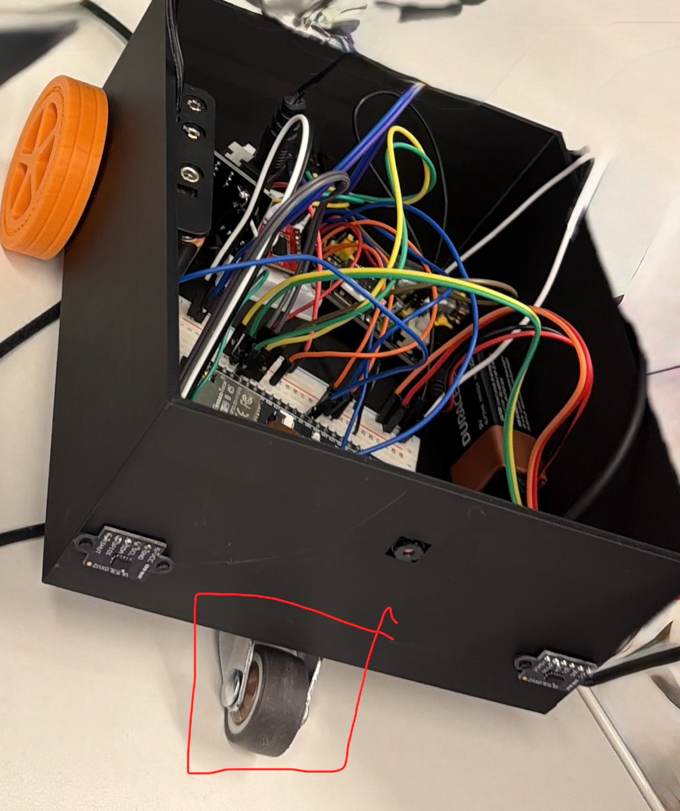

---

## April 23rd, 2026

**Objective:** Integrate flex sensor readings with gesture control and redesign the robot body for better component retention.

**Record of Work Done:**  
Roshni, Suvid, and I soldered the flex sensors and tested their analog readings. The ADC values changed significantly as the sensors bent, with a rough range around 1500–3000. These readings were integrated with the IMU-based gesture code so that movement commands would only activate when the fingers were bent.

I also worked on the robot body redesign. Earlier versions allowed components to shift during motion, so the new body added snap-in or guided areas for the breadboard, batteries, and other components. After about two revisions, the printed body fit the components much better.

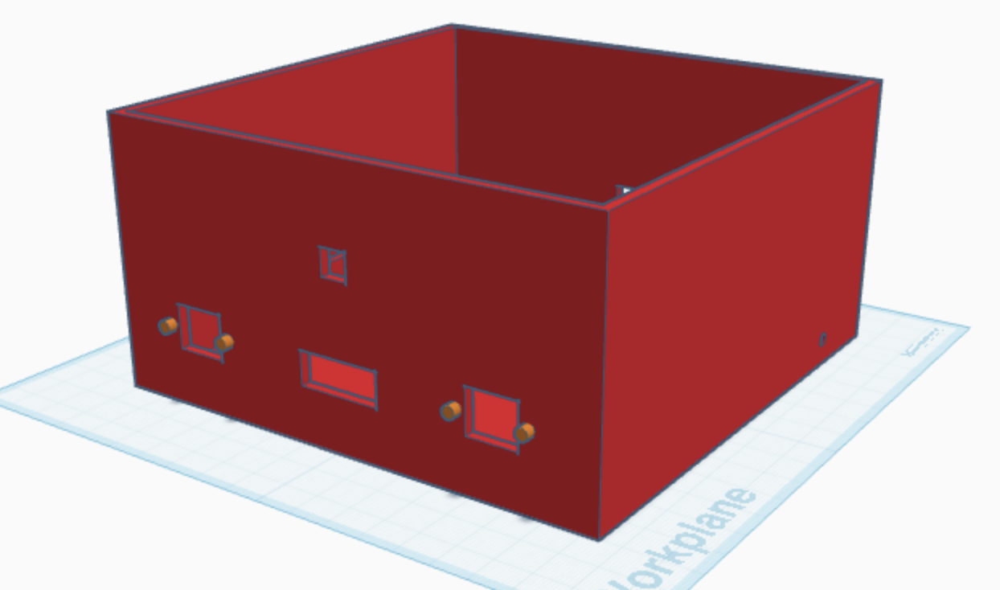

---

## April 24th, 2026

**Objective:** Redesign the glove for comfort and reliable flex sensor placement.

**Record of Work Done:**  
Roshni, Suvid, and I realized the first glove holder design was not comfortable because the flex sensors stuck out and scratched the fingers. We tested ideas such as hot-gluing glove fingers to the holder and sewing sleeves for the flex sensors, but these approaches either felt uncomfortable or slipped when the sensors bent.

The final approach was to weave the flex sensors through the glove fingers. This kept the sensors aligned with finger motion while still allowing the glove to be worn. The ADC range remained usable after this mechanical change, so this became the preferred glove design.

---

## April 25th, 2026

**Objective:** Assemble the improved robot, improve wheel traction, and test haptic obstacle feedback.

**Record of Work Done:**  
Roshni, Suvid, and I tested the glove after the haptic motors were soldered and working. The robot was updated so that when it detected an obstacle, it sent a message back to the glove and triggered haptic feedback. This closed the loop from robot sensing to user feedback.

We also assembled the newer robot body with larger wheels so it could move faster and better match the caster wheel height. Since the printed wheels still lacked traction, we added tape around the wheels to increase friction.

I also dismantled my WALL·E toy and used parts of it to improve the robot’s aesthetics. Roshni and Suvid helped fit the pieces onto the robot so the final prototype looked closer to the WALL·E-inspired design we had imagined. This made the demo feel more complete and engaging.

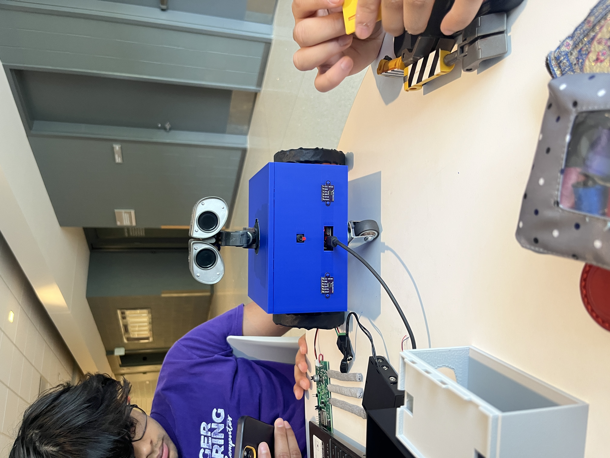

---

## April 26th, 2026

**Objective:** Add final demo features and improve the interaction between gestures, robot behavior, and haptic feedback.

**Record of Work Done:**  
With basic glove-to-robot control working, Roshni, Suvid, and I focused on additional features to make the demo more complete. We added gesture-triggered actions such as turning on the robot eyes, turning on the camera livestream, and making the robot perform a small shimmy motion.

We also improved directional haptic feedback. If the right ToF sensor detected an obstacle, the right haptic motor would buzz. If the left ToF sensor detected an obstacle, the left haptic motor would buzz. If an obstacle was detected directly in front or behind, both haptic motors would buzz. The glove also buzzed when it connected to the robot so the user knew the system was ready.

These features helped make the system feel more intuitive because the user did not only send commands to the robot; the robot could also communicate state and obstacle information back to the user.

---

## April 27th, 2026

**Objective:** Final demo preparation and record/replay feature implementation.

**Record of Work Done:**  
On demo day, Roshni, Suvid, and I added a record-and-replay feature. A three-finger flick toggled recording mode, and the system stored the following motion commands. The system could record up to 64 commands. After recording was toggled off, another gesture could replay the saved command sequence.

I helped with demo preparation by bringing the robot/WALL·E setup to ECEB, making sure the evaluation/verification materials were printed, and supporting final testing before the demo. The demo showed glove-based movement control, obstacle sensing, haptic feedback, camera/extra behaviors, and the final WALL·E-inspired robot form.

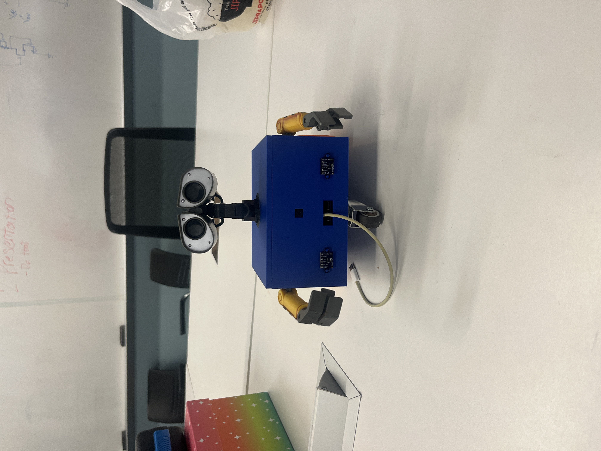

---

## April 28th, 2026

**Objective:** Document final demo outcome and collect video evidence.

**Record of Work Done:**  
The demo was completed successfully. Professor Zhao seemed excited by the final implementation and overall presentation. Roshni, Suvid, and I recorded videos of the final robot behavior so that the final report and video submission could show the major features clearly.

Key final demonstrated features included gesture-controlled movement, wireless glove-to-robot communication, obstacle detection, haptic feedback, camera livestream behavior, record/replay motion, and WALL·E-inspired packaging.

---

## April 29th, 2026

**Objective:** Collect and organize final project videos.

**Record of Work Done:**  
Roshni, Suvid, and I gathered the best robot demo videos for the final video submission. I sent over the strongest clips of the robot so Roshni and Suvid could help stitch them together into a final project video. The goal was to clearly show the glove gestures, robot movement, obstacle/haptic behavior, and the final physical build.

<video controls width="720" src="./media/final-demo-pt1.mp4">
    Your browser does not support embedded video.
</video>

---

## May 1st, 2026

**Objective:** Improve final presentation/report materials and consider quantitative verification visuals.

**Record of Work Done:**  
Roshni, Suvid, and I reviewed final video and presentation materials. We discussed adding a BLE latency graph to the Results and Verification section because latency is an important metric for a gesture-controlled robot. This would support the claim that the glove-to-robot control loop is responsive enough for intuitive use.

I also helped think through which demo videos best showed the system working and could make the presentation stronger.

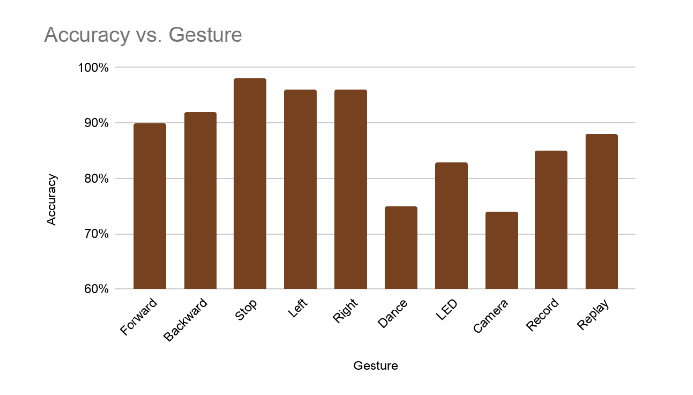
---

## May 2nd, 2026

**Objective:** Record final project outcome and recognition.

**Record of Work Done:**  
Our project received an ECE 445 Hall of Fame Honorable Mention. This meant a lot to Roshni, Suvid, and me because the final system came together after many debugging and integration issues. The recognition confirmed that the combination of gesture control, haptic feedback, surveillance features, and WALL·E-inspired design created a strong final prototype.

---

# Final System Summary

By the end of the semester, our project was a wearable glove-controlled mobile robot. The glove used an IMU and flex sensors to classify gestures, and it communicated commands wirelessly to the robot. The robot used an ESP32-based control system, DC motors, ToF sensors, and a camera. The robot could move based on hand gestures, stop or provide feedback when obstacles were detected, livestream camera video, and perform additional gesture-triggered actions.

My main contributions were focused on robot mechanical integration, 3D-printed body/wheel iteration, ToF sensor integration/testing, BLE/robot command testing, final assembly, WALL·E aesthetic integration, and final demo/video preparation. Roshni contributed heavily to the glove code, robot code integration, camera/motor bring-up, and final documentation. Suvid contributed heavily to the glove PCB, electrical integration, PCB debugging, and overall embedded hardware bring-up.