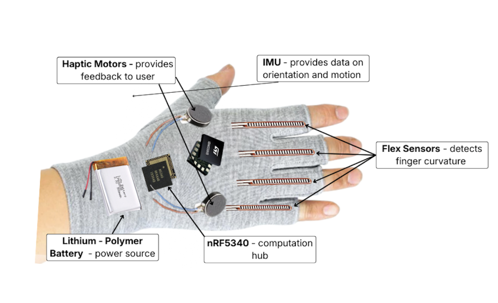
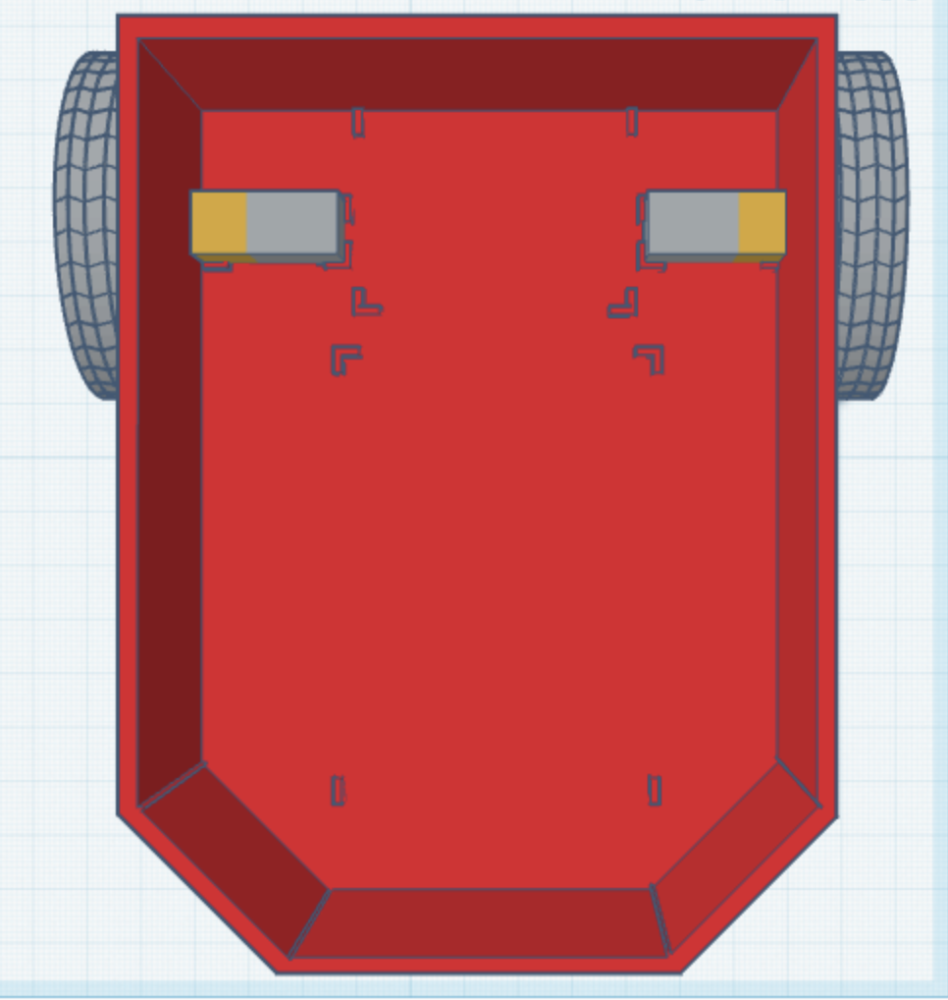
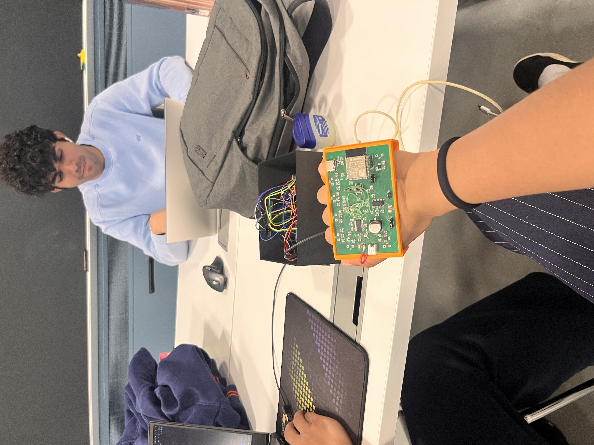
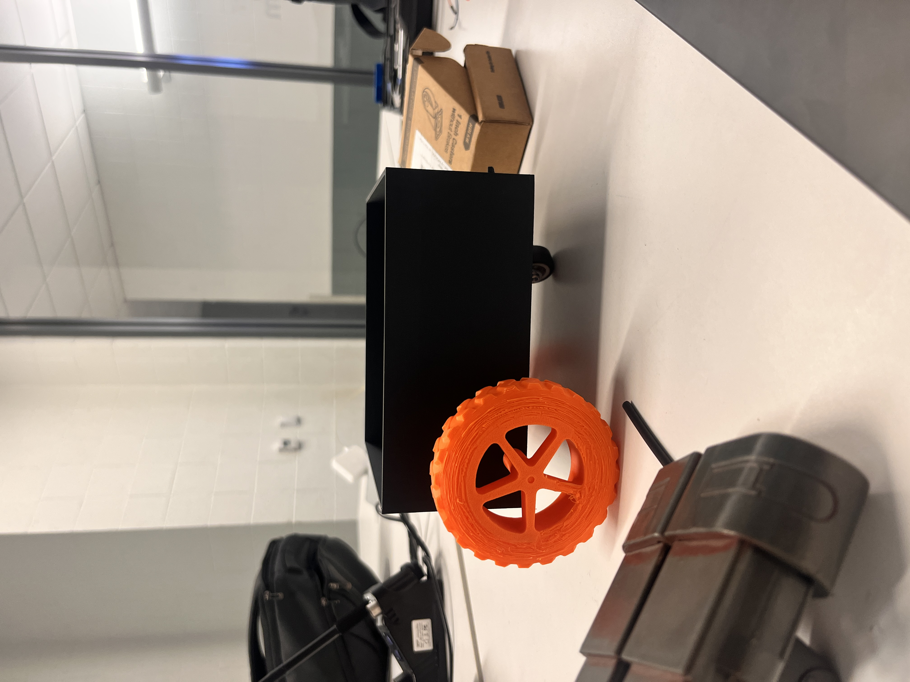
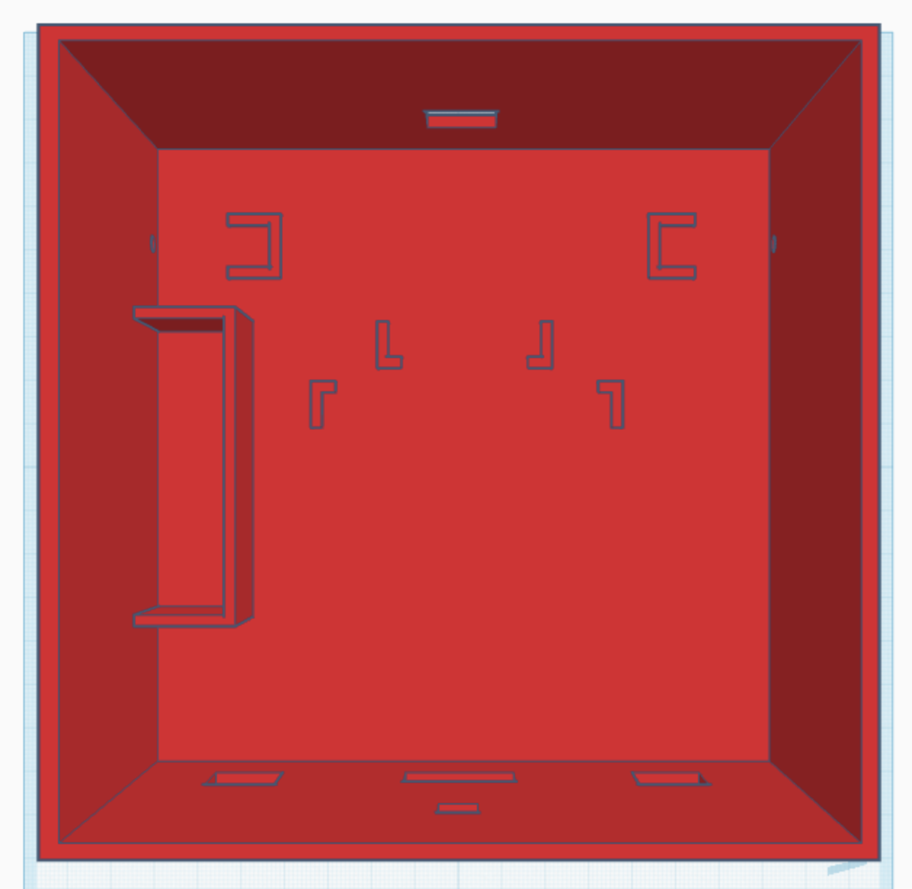
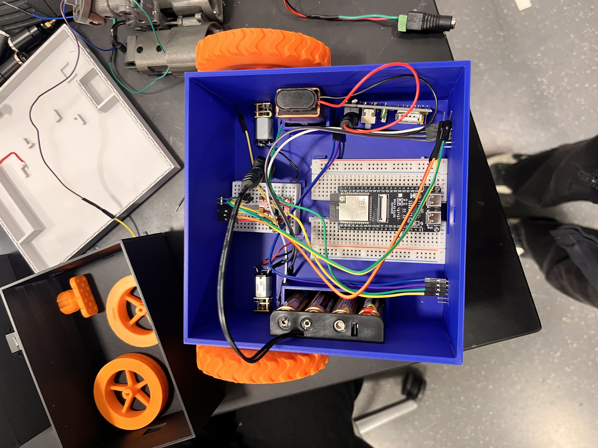

# Gesture Controlled Robot (D.I.G.I.T.)

## January 15th, 2026
**Brainstroming ideas for project** 
1. Wearable Motion-to-Sound Device - think like an air guitar, or air piano with diferent gestures controlling volume, pitch, vibrato. (Ex. [Commerical Motion-to-Sound Device](https://instrumentsofthings.com))

2. Tactile music visualizers for deaf/hard of hearing - something that could take different songs and turn them into LED patterns or even haptic buzzes
3. Smart refrigerator shelf - something that could detect when food has gone spoiled or detect if we don't have something (Ex. [Smart Fridge](https://www.instructables.com/Smart-Fridge-Tools-and-Materials/))

I like the Wearable Motion-to-Sound device the most because of all the gestures we could incorporate. Like we could have a certain set of gestures produce songs like a guitar, another for piano, another for a violin. Then you can have motions that increase the pitch or volume. It would be cool to provide another way to produce music and incorporate a bit dance into it. 

## January 26th, 2026
**Possible new idea: Gesture Controlled Robot**

Suvid found this idea and I think I have seen similar projects for it. He framed it as a surveillance robot and I really like that. We talked about incorporating fun features like obstacle avoidance (Kushl and Suvid want to do a whole computer vision algorithm and do obstacle detection but I think that's too much of a stretch). They also want to make it a two glove idea. One glove controls the robot and the other controls an arm on top of the robot. I don't think that's realistic but maybe? 

## February 1st, 2026
**Mind-Control vs Gesture-Control** 

Looked at the possibility of using the mind to control the robot because that would be cool. However, after further research it looks like the brain sensor itself would cost $130 (ex. [MindWave EEG sensor](https://www.robotshop.com/products/neurosky-mindwave-mobile-2-eeg-sensor-starter-kit?srsltid=AfmBOopJCThwyP1lGjXSEtGpsRtJxz7hSOcJk2BboltIA0DKG6iny4xI75E)). Also to build our own type of sensor would be quite expensive and may not even be accurate enough to control the robot. 

## February 2nd, 2026
**Finalized Project Idea** 

Met with TA to finalize the gesture controlled robot idea. He thinks having a PCB on just the glove would be complex enough and that the glove is the center of the project anyways. He said that we should start verifying bluetooth functionality because he anticipates that being our biggest hurdle. We also settled that we are only doing one glove that controls robot movement and not doing the second glove for controlling an arm on the robot. As cool as that would be, we don't have enough robotics experience to get the kinematics correct. 

## February 13th, 2026
**Project Proposal Submission**

Finalized problem is that current robotic control is not exactly intuitive to use nor accessible for those who lack fine motor control. This glove aims to fix that by requiring gestures people can make with their hand to control the robot. The purpose of this is for high stress situations when people can't stress about getting a joystick to turn enough. Our robot's focus will be surveillance so we will have safety features embedded like a camera so we can see where the robot is going ans ToF sensors to detect obstacles.

## February 16th, 2026
**Machine Shop Meeting**

Suvid and I met with the machine shop today to see if they could build the body of our robot. Seems like 445 has triple the number of projects from last semester. That's crazy. 

Anyways, machine shop says they can't do aesthetics. So if we want a robot to look like WallE, they can't do that. They also estimated a lot of our budget for making it so unsure whether this would work. However, he did have good ideas about the motors. He said not to use a track system because it will be hard to find sizing wise and expensive. 

## February 27th, 2026
**Design Review Submission**

Worked on the design review today. We finalized elements of the design like we are going to be using an nRF5340 chip because its known to be good for wearable devices and its low power. We also determined how big and fast our robot was going to be. We also decided that the glove will have an IMU and flex sensor as inputs for gesture classification and also haptic motors feedback. We also have divided our project into base goals and stretch features. 

Base Goals
1. Glove classifies five commands: stop, forward, backward, left, right
2. Glove transmits the command to the robot and it receives it
3. Robot does the corresponding command

Stretch Goals
1. Robot can stop in front of obstacles
2. Robot can livestream camera feed
3. Robot can send signal to glove that it has detected obstacle and glove can provide user with haptic feedback

Also designed a preliminary look of how the components would be laid out on the glove. Thinking of maybe 3D printing this instead of using a cloth glove? 

## March 10th, 2026
**Breadboard Demo Progress**

Suvid and I worked on preparing to show bluetooth functionality for the breadboard demo tomorrow. We have no parts though so we had to use my "Mary Poppins" box of parts. It ended up working out because I had a nRF based BlueFruit Feather BLE module and then we got an ESP32 C6. We developed a bluetooth signal code that could send data back and forth. It also controlled an old ToF sensor as well. Very basic work unfortunately but we were hoping to have had more of our parts by now. 

## March 23rd, 2026
**Breadboarding the Robot**

We finally got our parts just before spring break. I now have an ESP32 S3, the TB6612FNG motor driver, the VL53L0X ToF sensors, the OV3660 camera, and 6V microDC motors. 

To start, I worked on just getting the ESP32-S3 to control the motors through the motor driver. To do this, the simplest way was to import the motor driver library and look at githubs for how other people had done it. It took a while because there was this one function that refused to work with our motors. Still don't know why but I found a work around. The motors took the longest but everything else was straight forward.

Next was ToF sensors. I pretty much straight imported a github example of it and it worked with only a few wiring adjustment. The camera was the same. I found an example of an ESP32S3 CAM Dev Board with OV3660 camera and it worked almost immediately (once I figured out some WiFi bugs). 

From there, I got ChatGPT to merge the three codes such that different keyboard inputs moves the motors forward, backward, left, right, and stop. Also if it detects an obstacle with the ToF sensor it would just stop. The camera just livestreams the whole time. 

Here is a video of it:

<video controls width="720" src="./media/robot-parts-demo.MOV">
	Your browser does not support embedded video.
</video>

Here are links to the different githubs I used:
1. [TB6612FNG motor driver with ESP32-S3](https://github.com/pablopeza/TB6612FNG_ESP32)
2. [VL53L0X ToF sensor with ESP32-S3](https://github.com/benlazzero/Esp32S3-and-VL53L0X)
3. [OV3660 Camera with ESP32-S3](https://github.com/ginixsan/CamS3Library)

## March 31st, 2026
**CAD Design for Robot Body**

We decided against using the machine shop for our robot's body and to just 3D print it. Started the CAD design for our robot on TinkerCAD. There are probably better softwares for this...but this is the one I know how to use so I'm stuck with it. 

Here is the rough draft of what the robot might look like. I made it pentagonal because then ToF sensors can detect best when turning. I also measured everything so ToF sensors can like fit and snap into posiiton, the breadboards also snap in place so they don't move, and the motors have holes for the shaft. 

We also moved the camera from the top of the robot to the front because the camera ribbon cable is only like 2.5" so it would be impossible to put it high enough it could see over the robot. 

Here is the top view:

Here is the side view:

## April 4th, 2026
**3D printed Car Body v1**

Started the print for our robot. Realized Bambu machines are sooo much faster than the Creality Ender 3 Max I have. I thought the print of the body would take 10 hours. At least that was what Ultimaker said when I sliced it. But slicing it in Bambu Studio it said only 2 hours. Apparently each printer is $900 though.

First print output wasn't great. We realized the pentagonal shape would prevent ToF sensors from seeing in front and only would be useful while turning. Luckily we are scrapping it because the whole pentagon shape took way took way too long. Also all the snap in places to keep motors and breadboards in place were too small. All of the tolerances were off by 1-2mm, which apparently i pretty standard with 3D printing. I made those changes for our next version. 

## April 7th, 2026
**3D printed Car Body v2 + Assembling robot**

We printed the new version of the body which is just a rectangle of the same size. We remmoved all of the holders so everything can shift while the robot moves. Also printed wheels. Printing wheels took so many iterations because getting it to fit with the motors was just very tedious. Either a little bit too loose or too tight. Then we assembled everything. It feels a bit small because all the components just fit but that doesn't include the battery. 

Once assembled we added functionality to the robot so we could send the commands for movement over bluetooth from my phone. Issues with it was the wheels had no traction (make sense because it was 3D printed). Also since demo is tomorrow we had to print a caster wheel which was also awful. 

Next iteration we need to fix wheels and increase space to fit the battery.

## April 18th, 2026
**Glove PCB + 3D print design v1**

Suvid finally finished PCB today. We have had so many issues with it. But once he did, I got the measurements of it and started printing a holder for it. Our initial design is to try and 3D print the whole thing. Not sure how that would work or if it would work but we fit the pcb onto the holder. Here is what it looks like right now:

## April 20th, 2026
**Glove code + wheel redesign**

Now that we have a working PCB and a way of holding it, I started working on the glove code. Since the IMU works, we are using different rotations to code directions. Also tested the bluetooth so it is able to send the commands to the robot. Altered the robot code so that way it can receive commands from the glove rather than from a phone. Now it has like a client/subscriber setup where the glove is the client and the robot subscribes to messages for it. 

On the robot side, we finally got caster wheels from amazon. They are much taller than expected though so we will have to reprint the wheels. Or the robot will just be angled up. I kinda like the angled up because the camera can see more but I also want bigger wheels anyways so the car moves faster. 

We currently have the caster wheel just taped to the bottom which isn't great...

## April 23rd, 2026
**Glove with flex sensors + Robot body redesign**

We soldered the flex sensors on today and got a very preliminary code for seeing the ADC working for it. We can see the range change from 1500 - 3000 as you bend it. We integrated that with the IMU code so that way it only moves when the fingers are bent. We haven't put it on a glove yet and the flex sensors are just kinda sticking out. We manually are able to bend it and check if it works. So far it looks good.

Also redesigned the robot body again to have snap in place (trying that again). This way the components dont move too much when in motion. We also added snap in place for the batteries. This time when we printed it (after 2 revisions) everything fit. 

Here is the top view:

Here is the side view:

## April 24th, 2026
**Glove redesign v2**

Ok starting from scratch on the glove design. I don't like the holder thing with the flex sensors sticking out. We thought we could hot glue glove fingers to the holder and then it can bend with our fingers. That was too itchy though. The flex sensors edges kept scratching my fingers. I then sewed sleeves for the flex sensors so that it wont itch as much but they kept sliding off everytime the flex sensor was bent. 

Our final design was weaving the sensors through the fingers of the glove. This worked well and it could detect the same range of ADC values for bentness. 

## April 25th, 2026
**Glove works + New robot assembled**

Now that we have a properly designed glove, we are testing features. Suvid got the haptic motors soldered on and after testing we finallyyy got those working. Had a lot of issues with it. I changed the code so the robot would send a message to the glove when it detects an obstacle and then the glove would buzz to signal that the obstacle was there. 

Once that was done we made it so that the bentness controls speed of the robot. The issues we had with this was that it would go from slow to fast way too quickly so controlling speed wasn't great. I fixed the code so that the range of it was smaller and that speed was more varied.

We also assembled our new robot with the big wheels so it moves faster.

We added tape to the wheels for added friction. Also Kushl dismantled his WallE toy and we started adding parts of that to our robot for aesthetics. 

## April 26th, 2026
**Added new features**

Now that robot-glove functionality was confirmed we worked on adding additional nice-to-have features to make it cool. 
1. When you flick with your pointer finger, the eyes of the robot turns on
2. When you flick with your pointer and middle finger, the camera livestream turns on
3. When you flick with the middle and ring finger, the robot does a little shimmy
4. When the right ToF sensor detects an obstacle, the right haptic motor buzzes. When the left ToF sensor detects an obstacle, the left haptic motor buzzes. If there is an obstacle directly in front or behin it will buzz bost
5. When the robot connects to the glove, it buzzes the glove so the user knows it can start sending commands

## April 27th, 2026
**Record and replay feature**

Today is our demo, we added a new feature which is record and replay. Pretty much when you flick your three fingers it will do a record toggle so any motions after that it records. It can record up to 64 different commands. Then we can record toggle it off and it saves the sequence. Finally you can flick the pointer and ring finger and it will replay that motion. I was really excited abou this one because we got it working in an 1.5 hrs during a tornado. 

## April 28th, 2026
**Demo Finished Yesterday!**

Finished our demo yesterday!! It went well our professor seemed excited. We recorded a video for it. 

<video controls width="720" src="./media/final-demo-pt1.mp4">
	Your browser does not support embedded video.
</video>
