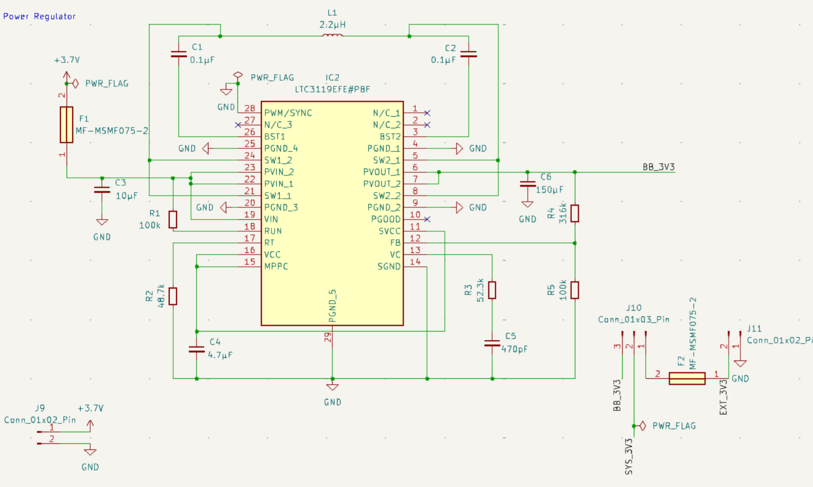
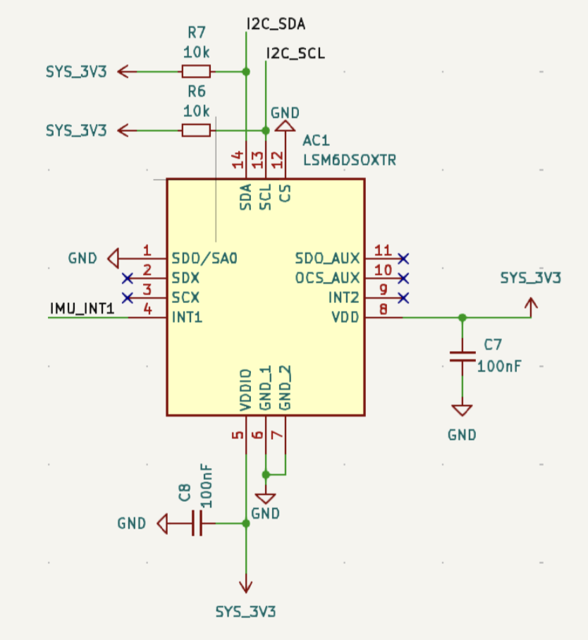
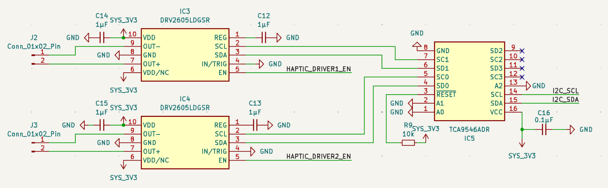
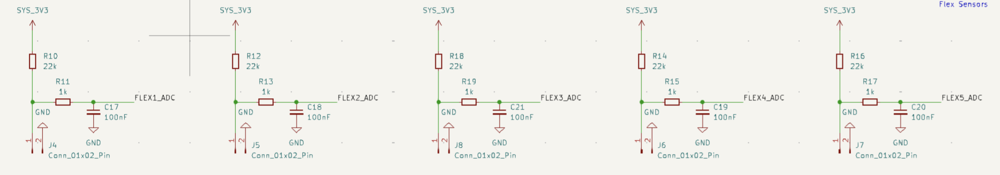
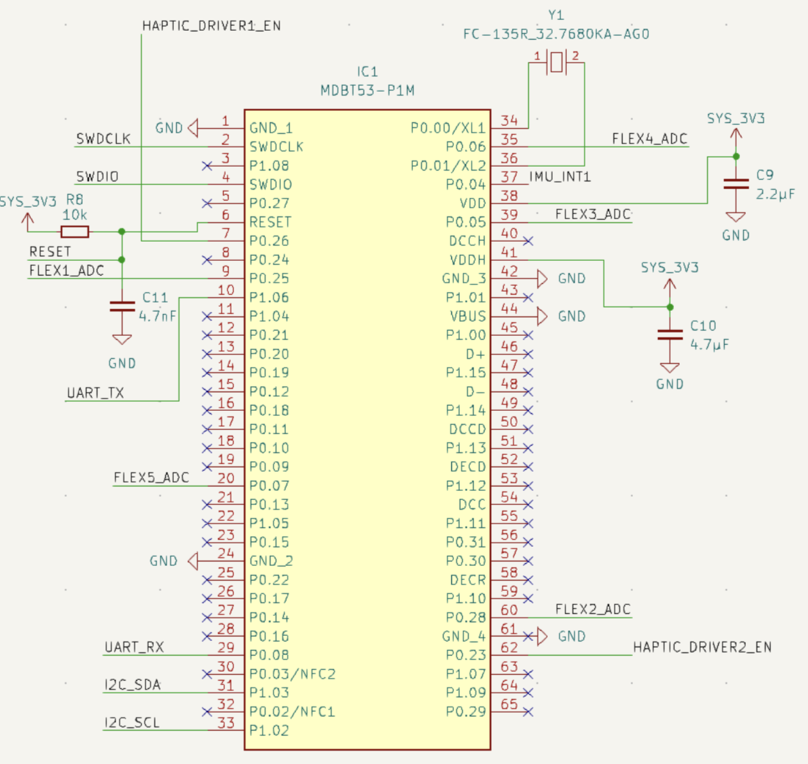
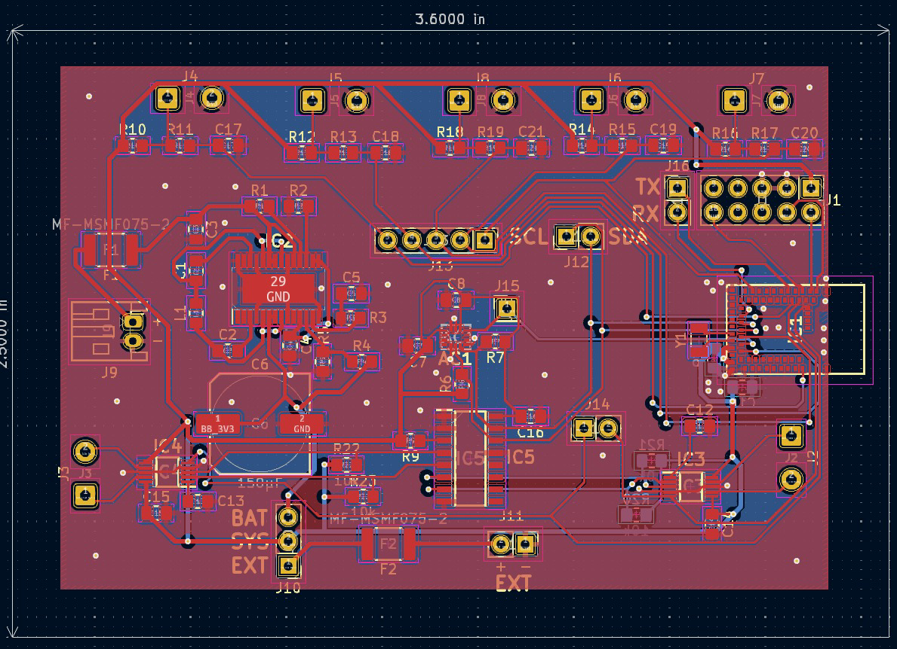
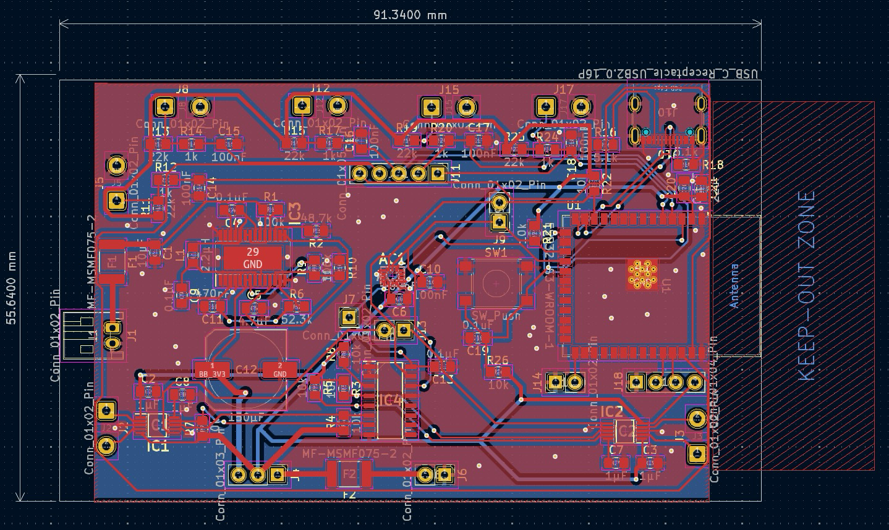
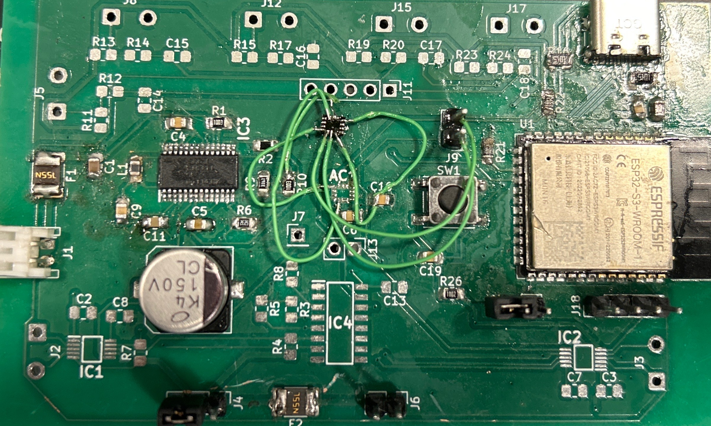

# D.I.G.I.T: Digital Interactive Gesture Interface for Teleoperation

## January 22nd, 2026
**Project Idea Brainstorm**

Brainstormed a list of project ideas for what we could do:
1. Gesture-to-robot control with IMU glove - dedicated gesture like "come here", "go to this spot", "scan the room", etc. 
Parts required: IMU, Flex sensors, gloves, camera, car, MCU, ToF sensor...
2. Self balancing two wheeled robot - robot bike that has a self balancing system. Parts: gyroscope, weights, how do we balance it?
3. Robot Tag game - Maybe have like 2 or 3 robots and we make them play tag using AI, and also have human controlled mode, should not need to map out the room, they should be able to navigate objects on their own, and they need to know who the catcher / where the catcher is
4. Robotic “whiteboard eraser” that cleans where you point - Can it clean an area around the laser pointed region? Maybe be able to set up the path? Map the whiteboard? Always have it stuck to the white board using a vacuum seal?

## January 27th, 2026
**WallE robot with trash cleaning feature**

Kushl wants to do something with robotics so we were looking at a WallE-esque robot but can't figure out what the purpose of the robot would be. I don't know the problem it would be solving. If we could incorporate like a trash detection feature or trash crushing feature then the purpose is there? But we would need to figure out how to get the crushing implemented. Maybe machine shop could do something with that?

## February 3rd, 2026
**Finalized project idea**

Our final project will be the gesture controlled robot with a WallE look. The problem we are thinking of solving is in the surveillance field where robot control isn't very intuitive or accessible for those with fine motor skills. We aim to show that gesture control is a viable alternative. 

We divvied the project work up amongst the three of us. Roshni is responsible for the software and embedded work. Kushl is responsible for robot design and look. I am responsible for the PCB for the glove. 

We decided that only the glove will have a PCB because I am on the only one with PCB experience and from what I've done I think getting even one PCB working is going to be a stretch...

## February 10th, 2026
**Glove Parts Research**

Ok so since I am responsible for PCB I've been doing a lot of the research on parts for what would be best for the glove.
1. After talking to our TA, we are thinking of using an nRF chip because they are known to be good for wearables since they have a low power consumption. The one I think that would best fit our project is the nRF5340 because it has a dual core so one can do the bluetooth communication and the other core can be responsible for gesture classification
2. Looking at the LSM6DSOX for the IMU because it has a 6-axis gyro and there is a good amount of research online for other projects using it and it working. 
3. I think we will need an I2C mux for the chip because we have 2 haptic motors and both use the same address on the bus. I think we will differentiate between commands for buzzing the left vs right haptic motor so then we need to be able to individually access each motor driver.
4. Flex sensor wise I think we will have to go with the ones in the ECEB supply shop because its the cheapest. They sell it for $8 vs $12 everywhere else. Also I don't think we can do 5 flex sensors as originally planned because thats almost a 1/3rd of our budget and thats assuming they all work first try. Maybe we just do 3?
5. I want our power system to not just be a voltage regulator but also a buck boost converter so that way we can provide it a variable voltage supply and it should be able to buck it down to 3V3 or boost it up to 3V3.

## February 16th, 2026
**Met with Machine Shop**

Roshni and I met with machine shop to see if it would be possible for the machine shop to design the robot. We were hoping they could develop WallE features but they don't do that. Need to reconsider our current track system. Apparently past groups have had issues with this because its costly and hard to find. He provided motors to use though. Looked more into it. I like the [100RPM 6V motors](https://www.amazon.com/Greartisan-100RPM-Torque-Reduction-Gearbox/dp/B07FVNQZY6/ref=sr_1_1_sspa?crid=3M1DWIY5MVOR7&dib=eyJ2IjoiMSJ9.qHBZaI2kfOgu_WhW1JJSrAqaPsyxXbwpwRiR_78-cr3vDJTIdam1K9oTxTlFfJ62bMqsI6oKP6-nsYsGZVtF8E1ob_j915087f7cOE1jCgL2Kj3BuOKWE93c1vP4TE9VathXHnjkYosYX5ivjX9DCcigb1UW780Jl-morOxbMXzIb-hVOTIpFLTJYmw4hZx-1_w_iY9OYxIRfsk5AcfvDNFTOKpREDzf6boF0cAYnYkSTWhOgZXslR_enUQ5aFl8gQP4ndqq-puuub-1POyxz2n7pFyreFs7a9LUC-MUVrQ.i1IzbWQP47dr4gF63sY4tgRBJaGUAbQR8kF4DMh6iOk&dib_tag=se&keywords=6v%2B100rpm%2Bmotors&qid=1777932657&s=industrial&sprefix=6v%2B100rpm%2Bmotor%2Cindustrial%2C116&sr=1-1-spons&sp_csd=d2lkZ2V0TmFtZT1zcF9hdGY&th=1) from Amazon. 

## February 18th, 2026
**PCB Design Pt. 1**

Started the PCB design for the glove because the extra credit PCB review is in a few days. Started with power system first because nothing runs without it. Found a schematic online for it that I used as a reference point. Have attached the schematic for it below: 

After the power system, I worked on the IMU system.

Then the haptic motor drivers with the I2C mux:

Next the flex sensors:

Finally the nRF5240:

## February 24th, 2026
**Did the Extra Credit PCB Review**

We presented our current PCB design to the TA. Right now we just have the schematic for all of the parts and the layout without traces of the PCB. He recommended a few things that will be good additions:
1. Adding test points for each subsystem so we can measure the voltage outputs
2. He also recommended isolating each subsystem so you can prove functionality one at a time rather than each one dependent on another. 

## February 25th, 2026
**PCB Design Pt. 2**

Made the edits to the PCB that the TA recommended. I also compiled a list of all the parts we needed for it. Last year in 395, I accidentally made each of the capacitor and resistor pads way too small. They were 0604 so this year wanted to make sure I didn't repeat that. I decided to make them 0805 so it would be easier to solder. After that I completed the layout for order submission. 

Here is the final layout:

## February 26th, 2026
**Submitted PCB Order**

We just submitted a round 1 PCB order so fingers crossed it comes soon. I also finished compiling the list of parts we needed and submitted orders to Argy for DigiKey and Mouser. I realized to program the nRF, we would have to either buy a programmer which costs like $384 or just by the dev board with JLink debugger which could program our device which was $50 so we also added that to our order. I think we might be going over budget with our parts but the teammates agreed to split. 

## March 10th, 2026
**Breadboard Demo Progress**

So we don't have any of our parts still. We were able to find a nRF bluetooth chip, borrowed a ToF sensor, and bought an esp32-c6 from the supply shop. From that I worked to get the bluetooth functionality setup so you could send messages from one device to another and then the esp32 can read ToF data from the sensor. If the bluetooth connection drops then it stops reading the ToF data. This is supposed to represent the robot stopping if it disconnects from the glove. 

## March 26th, 2026
**Started soldering our PCB**

We finally got our PCB. I have started soldering the power subsystem and the nRF chip. I used the wrong pad sizing for one of the big capacitors so had to wire it using wires to the PCB. 

I had to buy my own soldering iron because despite using a bigger pad size it was still too small to use the lab irons. I also bought my own soldering paste for ease of use. My first attempt to solder the nRF was to use the reflow oven because that was recommended by chatGPT and TAs because the nRF5340 doesn't have pins like an ESP32 does. It has pads at the bottom of it we need to solder to the PCB but it's been quite difficult trying to align it.

The first time using the reflow oven, we put it in for 30 min at 200C. I am worried we burned the chip because after talking to friends who have used the oven it seems like it could have burned the chip. 

## April 1st, 2026
**Unconfident about success of this PCB and using nRF5340**

After 3 days of trying to get the nRF to work, I don't think we are going to be able to solder the chip on. I think the reflow oven definitely burned the first chip. I soldered a second one and was able to see it with my laptop. However, I can't tell if I am seeing the chip on the PCB or the chip on the dev board because we are using the dev board to program the chip. I tried flashing something onto it and it doesn't seem to work either. 

I tweaked with the reset circuit because I think something might be wrong with it, but after that I haven't been able to seen the chip since. Definitely think I burnt the chip again. 

We talked to friends in EV Illini Concept and they all agreed that it might be time to either reorder more chips or use a different CPU entirely. 

## April 3rd, 2026
**Started PCB with ESP32-S3**

We presented our progress demo to the professor and TA and we proposed 2 possible solutions to our issue. 
1. Order more nRF5340 chips to see if we can get our PCB working
2. Start over and do a PCB with an ESP32S3

We decided to both as a backup in case one doesn't work. I started working on the PCB for the ESP32-S3. I was able to finish the sechamtic for it today and should do layout for it tomorrow. Most of it was transferable from the last PCB but some of the connections had to be copy pasted / changed a bit. 

## April 6th, 2026
**Submitted our own PCB order with express shipping**

Today we submitted the PCB and additional parts. We paid extra for express shipping and its anticipated to arrive by Monday so we should have enough time to solder it and get it tested. We also ordered a bunch more nRF5340 chips in hopes of getting our original PCB working. 

In the meantime, I helped Kushl get the ToF sensors working. Roshni had gotten 1 ToF sensor working as proof of concept. Kushl was working on getting all 3 ToF sensors working simultaneously. We have only 2 I2C channels so we have the back and left on one channel and the right on the other so that way we can monitor the right and left at the same time. Otherwise we would have to rapidly switch between them. 

## April 15th, 2026
**PCB arrived. Started soldering again**

I started soldering the parts again doing it in the same order. Starting with the power system, I had fixed the pad sizing issue with the capacitor so that way it is able to fit the capacitors without additional wires. Once the power system was soldered, I soldered the ESP32S3 and started testing it.

It worked pretty much on the first try and we were able to program it. We tested the programming actually worked by having one of the GPIOs oscillate and us checking that with an oscilliscope. 

We then programmed it with bluetooth functionality but we noticed that it would randomly brownout. In theory it should be able to bring up to 15V down to 3.3V. However, initially it could not do anything above 9V. Then it couldn't do anything about 5.85V. So our makeshift solution has been to use a slightly dead battery. 

## April 18th, 2026
**IMU doesn't work + Fix**

The next thing I soldered is the IMU. Had a similar issue with nRF because the IMU has pads on the bottom instead of pins so we couldn't tell if it was soldered correctly. However after a few iterations, we realized it was not an issue with the IMU but because we had wired Chip Select to GND. This meant that the IMU was on SPI mode and I had designed it to be in I2C mode. 

To fix this I initially tried to cut the trace to ground and then connect that trace to 3V3 but everytime I tried it, the trace was way too close to GND and I was worried it would short and burn our board. 

Then I decided to hot glue the IMU upside down on the PCB and solder wires out of the IMU to parts of the PCB into what Roshni likes to call an IMU octopus. 

## April 23rd, 2026
**Soldered the flex sensors on**

Had no issues soldering the flex sensors on. Wrote some code for basic functionality of it making sure that the system can detect if the sensor is bent versus straight. It worked without much issues. One thing I initially considered was soldering wires onto the flex sensor and then soldering those wires to the PCB. I decided against that because I thought it would move too much and could rip the pads out of the PCB off. 

## April 25th, 2026
**Issues with haptic motors + Fix**

We also had issues with the haptic motors because the layout on the PCB was mirror of what the schematic showed so we had to solder the haptic motor upside down. Initially, I thought both motors were flipped and rotated in the same way but I was wrong. The left one had to be rotated more than the right to make it work. I realized this issue when we weren't able to see the haptic motors properly on the I2C bus. Like it couldn't see the address. The one haptic motor being flipped cause both to not work properly. Once I fixed that, then I could see and control both haptic motors on the bus. 

## April 26th, 2026
**New flex sensor attachment design**

The flex sensors kept breaking / the readings kept going to 4096 (max possible value). We have to buy a new one before our demo tomorrow. In the meantime I have been trying to brainstorm what could fix this issue. I decided to go back to my initial design of soldering wires to the flex sensors and then soldering those wires to the PCB. Once I did that, it seemed to work much more reliably. I experimented with different wire thicknesses for this. Initially I wanted to use a thin wire so if it was going to rip off it would not take the pad with it. But the wire kept breaking off. I then tried a thicker wire to solder it to the PCB and that worked more reliably. 

## April 28th, 2026
**Final demo videos**

Here is the final videos from our project. Everything worked.

<video controls width="720" src="./media/final-demo-pt1.mp4">
</video>